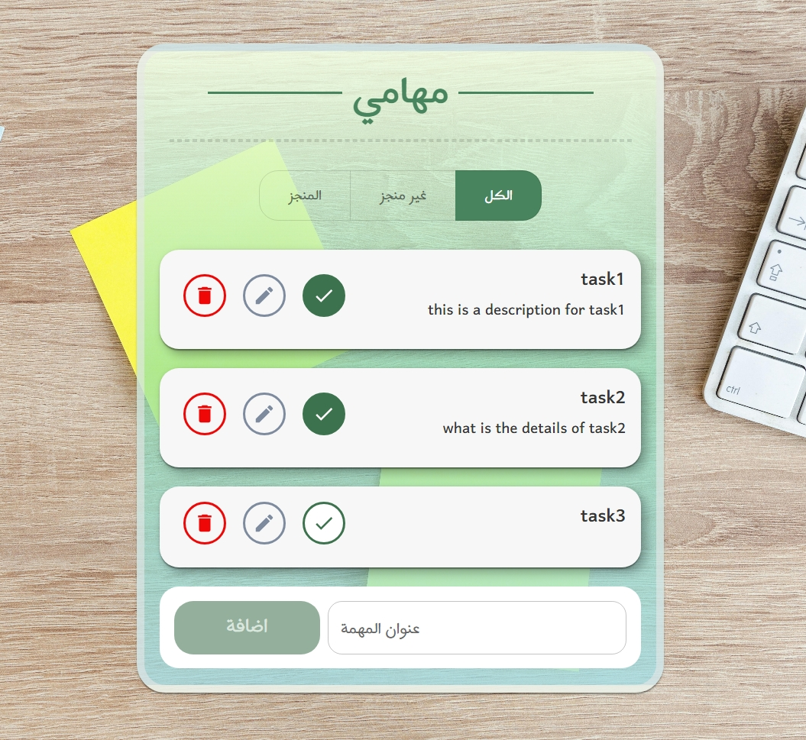

# 📝 ToDo App

A modern and simple ToDo application built using React and Material UI.

---

## 🚀 Features

* ➕ Add new tasks
* 🗑️ Delete tasks
* ✏️ Edit tasks
* ✅ Mark tasks as completed / uncompleted
* 🔍 Filter tasks (All / Completed / Not Completed)
* 🔔 Toast notifications (success, error, info)
* 💾 Data saved in LocalStorage

---

## 🛠️ Tech Stack

* React
* Material UI
* Context API
* LocalStorage

---

## 📸 Screenshots

(Add screenshots here later)

---

## ⚙️ Installation

```bash
npm install
npm run dev
```

---

## 📂 Project Structure

```bash
src/
 ├── Component/
 │    ├── ToDoList.jsx
 │    ├── Todo.jsx
 │    └── MySnackBar.jsx
 ├── Context/
 │    ├── context.js
 │    └── ToastContext.js
 └── App.jsx
```

---

## 💡 What I Learned

* Using Context API for state management
* Building reusable components
* Handling UI feedback with Toast system
* Working with LocalStorage

---

## 👨‍💻 Author

Yousif Gharib


